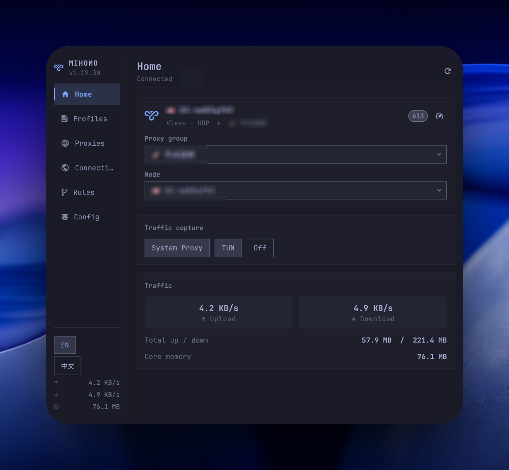

# Mihomo



Omarchy bar plugin: a control panel for the mihomo core. Left nav rail plus a
right-hand page, covering **Home / Profiles / Proxies / Config / Connections /
Rules**, with setup and network diagnostics available when needed.

Talks to mihomo's external controller (REST API) directly. It does **not**
depend on Clash Verge or any other GUI client. The core alone is enough.

The UI defaults to **English**. Switch to Chinese with the EN / 中文 buttons
in the sidebar or on the Config page.

License: MIT. See [LICENSE](LICENSE).

## Install

```sh
omarchy plugin add https://github.com/lijiawei0305-pixel/omarchy-mihomo-plugin.git --enable
omarchy bar move io.github.lijiawei0305-pixel.mihomo --section right
```

That clones the repo, validates `manifest.json`, and enables the plugin. Plugin
installation does not run an installer and does not ask for elevated privileges.
The plugin does not install Mihomo. Profile management is optional; first-time
setup can reuse a reachable core or start a plugin-owned service around an
already installed Mihomo binary.

## Remove

```sh
omarchy plugin remove io.github.lijiawei0305-pixel.mihomo
```

That disables the widget and deletes the plugin checkout. Language preference
in `~/.config/omarchy-mihomo/ui` is left in place; delete that file yourself
if you want it gone.

## Dependencies

- `bash` and `curl` (used by `bin/mihomo-ctl` to talk to the core)
- A running [mihomo](https://github.com/MetaCubeX/mihomo) core with its
  external controller enabled (the default)

The plugin does not install Mihomo. Raw Config mode does not write your yaml;
managed profiles keep source YAML and generated runtime configuration
separately. It can switch **system proxy** (desktop + session environment) and
**TUN** from the Home page. Those two toggles are independent: turning one off
does not change the other.

## Managed Profiles

Managed profiles are optional. Users who already run their own Mihomo core can
continue using the plugin without installing or enabling the manager. In that
raw-config workflow, the Config page continues to work with the user's
hand-written YAML and the existing controller operations remain available.

When managed mode is selected, subscription and local profiles are kept under
the plugin's private data directory. Source YAML, generated runtime YAML, and
global/profile overrides are stored separately. The manager compiles a
candidate in this order:

```text
source → global override → profile override → custom rules → managed settings
```

The candidate is validated before it replaces the active runtime config. Apply
and update operations use atomic writes and rollback, so a failed validation or
controller apply does not discard the last known-good configuration.

Installing the manager is an explicit action. `bin/install-manager` downloads
the matching release asset from this repository and verifies `SHA256SUMS`; it
does not run during plugin installation or silently install privileged software.
The release is needed because plugin installation is source-only and does not
compile Go on the user's machine. Releases provide prebuilt manager binaries
for supported CPU architectures and a checksum file.

## Pages

| Page | What it shows | APIs |
|------|----------------|------|
| Home | Current node, system proxy / TUN capture, how to link the core, network overview, proxy mode, traffic | `/version` `/configs` `/proxies` `/traffic` `/memory` plus OS proxy |
| Profiles | Add or import profiles, switch and update them, and inspect source/runtime/overrides | `mihomo-manager` |
| Proxies | Proxy groups, expand nodes, switch, group or single-node latency tests | `/proxies` `/proxies/{name}` `/group/{name}/delay` |
| Config | Hand-written yaml path / stats, reload the core, open the editor; rule providers can be refreshed | `configinfo` `PUT /configs` `/providers/rules` |
| Connections | Active connections, up/down, chain and matched rule; filter, close one, close all | `/connections` |
| Rules | Every rule from the config; filter by domain / type / target | `/rules` |
| Diagnostics | Core setup, TUN/network checks, and recovery hints | `mihomo-manager` / `mihomo-setup` |

Writes (switch node, switch mode, latency test, close connections, update a
provider, enable TUN) go to the running core. Profile and managed-settings
writes use `bin/mihomo-manager`, which validates generated configuration before
applying it. Other front-ends see the same state. System proxy is written to
the OS, the same way
[Clash Verge Rev](https://github.com/clash-verge-rev/clash-verge-rev) does on
Linux (`gsettings` / `dconf`), plus the systemd user environment Hyprland
reads.

## Language

Default is English. The EN / 中文 switch is in the sidebar footer and on the
Config page. The choice is stored in `~/.config/omarchy-mihomo/ui` and survives
restarts:

```
language = en
sysproxy = off
```

Use `zh` for Chinese. `sysproxy = on` means this plugin last turned the OS
proxy on, so a mixed-port change can rewrite it.

## Link the core

The panel talks to a running mihomo core directly. In Raw Config mode, run your
own core, then expose its API. Profile mode can instead use the one-time setup
action to start a plugin-owned service around an installed binary.

In the core yaml:

```yaml
external-controller: 127.0.0.1:9090
# secret: your-secret
```

**9090** (or whatever you set as `external-controller`) is only for this panel.
Apps use **mixed-port** or TUN. Home shows the live API, yaml path, and mixed
port, plus a one-line yaml example.

The panel never hardcodes an address. Every `bin/mihomo-ctl` call probes in
order and uses the first hit:

1. `~/.config/omarchy-mihomo/config` — manual override
2. Flags on the running core — `-ext-ctl` / `-ext-ctl-unix` / `-secret`
3. The yaml that core was started with — `external-controller` / `external-controller-unix` / `secret`
4. `127.0.0.1:9090`, no secret — mihomo's default

So it finds the core whether it listens on a TCP port or a Unix socket, with or
without a secret.

If the port or secret is not the default, create
`~/.config/omarchy-mihomo/config`:

```
endpoint = 127.0.0.1:9090
# or a unix socket:
# socket = /run/mihomo/mihomo.sock
secret = your-secret
```

The yaml `secret:` and this file must match. Check what was resolved:

```sh
~/.config/omarchy/plugins/io.github.lijiawei0305-pixel.mihomo/bin/mihomo-ctl endpoint
```

## Keyboard

With the panel open (`Esc` closes, `Tab` moves to the next panel):

| Key | Action |
|-----|--------|
| `1` – `6` | Jump to Home / Profiles / Proxies / Connections / Rules / Config |
| `←` `→` `h` `l` | Previous / next page |
| `↑` `↓` `j` `k` | Scroll the current page |
| `/` | Focus the filter (Connections, Rules) |
| `r` | Refresh the current page |

On the Proxies page, left-click a node to switch, right-click to test that
node's latency.

## Notes

- On Home, **System proxy** and **TUN** toggle on their own. In managed profile
  mode, TUN defaults to off and uses `gvisor` when enabled. Off clears both.
  TUN captures everything; system proxy only the apps that honour it. Ports,
  LAN and IPv6 stay read-only; edit the yaml and reload for those.
- System proxy points HTTP/HTTPS/SOCKS at the mixed port and requires a real
  listener there. It bypasses `localhost`, `127.0.0.1`, RFC1918 ranges and
  `::1`, matching Clash Verge's Linux default.
- In Raw Config mode, TUN is `PATCH /configs` with `tun.enable`. The core
  needs `cap_net_admin` (or to run as root). Managed profile mode checks
  capability and firewall compatibility in Diagnostics before enabling TUN; the
  plugin does not install a privileged helper.
- Only `Selector` groups accept a manual node. `URLTest` / `Fallback` /
  `LoadBalance` are chosen by the core, and the API rejects a forced pick.
- In Raw Config mode, the Config page is that handwritten yaml. Nodes live under
  `proxies:`; there is no subscription fetch on that page. Use Profiles for
  subscriptions and managed configs. Rule providers can still be refreshed by
  hand. After you save the file, use **Reload config** — no service restart
  needed.
- While the panel is closed it only does a light poll every 30 seconds. Opening
  it starts the `/traffic` and `/memory` streams and fetches whatever the
  current page needs.

## Development

The repo is the source of truth. After an edit:

```sh
./deploy
cd manager && go test ./...
```

That validates the manifest, syncs to
`~/.config/omarchy/plugins/io.github.lijiawei0305-pixel.mihomo/`, and restarts
the shell. Hot reload is unreliable; a restart is the sure way.

```sh
omarchy plugin validate .
omarchy-shell io.github.lijiawei0305-pixel.mihomo open
```

## Testing

The CI checks are dependency-light and use temporary directories and fake
controller/core programs where possible:

```sh
go -C manager test ./...
go -C manager vet ./...
./tests/integration.sh
./tests/bootstrap.sh
./tests/sysproxy.sh
./tests/validate-plugin.sh
bash -n deploy bin/* tests/*.sh
omarchy plugin validate .
```

For a local UI smoke test, run `./deploy` on an Omarchy machine, then open the
widget with `omarchy-shell io.github.lijiawei0305-pixel.mihomo open`. Check both
paths:

1. Raw Config mode: use an independently running Mihomo core and verify core
   discovery, node switching, Config reload, Proxies, Connections, Rules, and
   system proxy.
2. Managed mode: build or install the manager, then verify profile import,
   activation, update, overrides, custom rules, Diagnostics, TUN with the
   `gvisor` stack, and rollback after a failed apply.

`tests/reset_mihomo_plugin_test.sh` is an optional, manual clean-room test for
Arch/Omarchy onboarding. It is destructive: it asks for confirmation, stops
named Mihomo services/processes, clears plugin state and proxy state, removes
known Mihomo packages, installs the local checkout, and installs a supplied
Arch package. It does not delete `~/.config/mihomo`, and it is not run in CI.

```sh
./tests/reset_mihomo_plugin_test.sh --package /path/to/mihomo.pkg.tar.zst
```

The script leaves the machine at the first-run state and tells the tester to
open the widget and click **Set up Mihomo**. Keep the UI message and
`journalctl --user -f` output if setup fails. A release containing the manager
assets must exist for this final installer-path test; before that release,
only use a temporary test repository through `OMARCHY_MIHOMO_MANAGER_REPO`.
